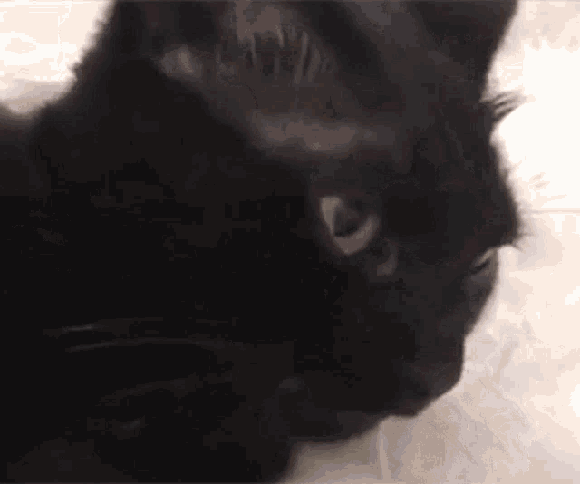

<meta property="og:type" content="website">
<meta property="og:url" content="https://potatointhebox.github.io/TestPage/">
<meta property="og:title" content="Breaking News! No one cares!">
<meta property="og:description" content="You should totally click this link.">
<meta property="og:image" content="game_cat.png">

## Welcome to GitHub Pages

### Cat!

